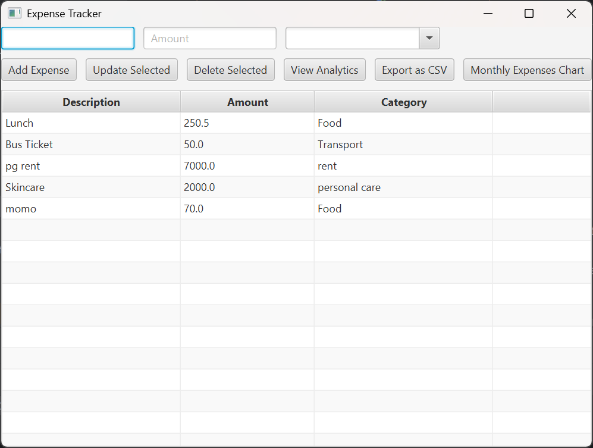
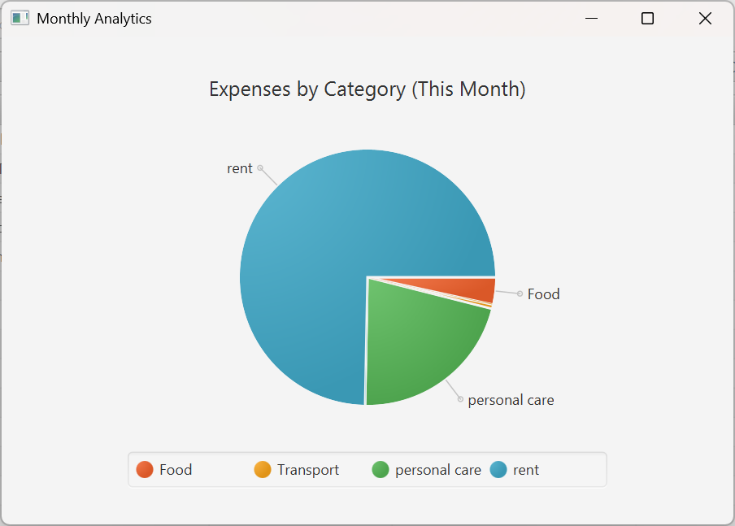

# Expense Tracker

A simple JavaFX-based desktop application to manage and track your expenses.  
You can add, delete, and view expenses in an intuitive user interface.

## Features
- Add new expenses with details (amount, category, date)
- View all expenses in a table format
- Delete or update expenses
- Lightweight and easy to use

## Technologies Used
- Java 17 / 21
- JavaFX 21
- IntelliJ IDEA (for development)

## How to Run
1. Make sure you have **Java 17 or above** installed.
2. Download [JavaFX SDK](https://openjfx.io/).
3. Clone this repository:
   ```bash
   git clone https://github.com/Sheetal2000/ExpenseTracker.git
4. Open the project in IntelliJ and set VM options:
   ``` 
    --module-path "path-to-javafx-sdk/lib" --add-modules javafx.controls,javafx.fxml
5. Build and run the project.

## How to Run the JAR File

    java --module-path "path-to-javafx-sdk/lib" --add-modules javafx.controls,javafx.fxml -jar ExpenseTracker.jar

## Screenshots
### ExpanseTrackerUI


### Analytics


## License

This project is licensed under the MIT License.